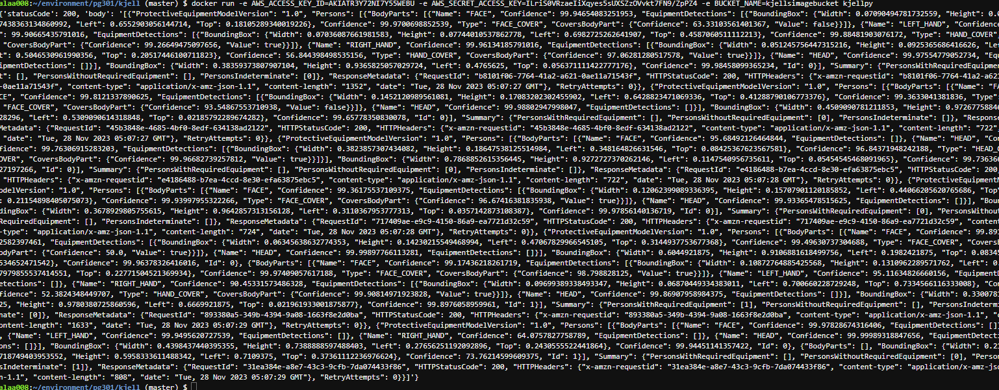
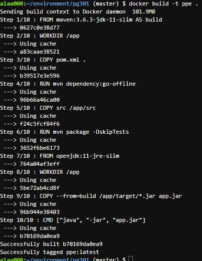
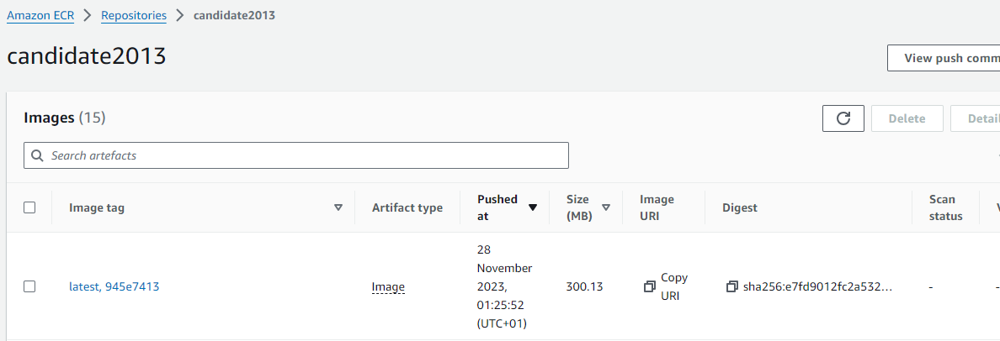

## OPPGAVE 1


For å gjennomføre denne oppgaven/workflowen (og de kommende) må du 
konfigurere følgende secrets:
- AWS_ACCESS_KEY_ID 
- AWS_SECRET_ACCESS_KEY

Jeg gjorde om det hardcodete bucket-navnet til å bruke miljøvariabel slik:

```
try:
    BUCKET_NAME = os.environ['BUCKET_NAME']
except KeyError:
    raise ValueError("The environment variable <BUCKET_NAME> seems to be missing.")
```

```
Environment:
        Variables:
          BUCKET_NAME: !Ref ImageS3Bucket
```
Ovenfor er endringen gjort slik SAM kan benytte S3 bucket`en.

## Oppgave 1
**A**

Slet en del med navn på bucket, så tilslutt ble det et veldig fjasete navn (litt
fordi jeg ble sint...) men når navnet kom på plass så det til å fungere! 


**B**
Jeg hadde problemer med å dockerize, derav ligger det er par kommenterte linjer
som jeg fikk bruk for tidligere. De ville jeg ta vare på om jeg muligens måtte 
ta de ibruk igjen
```
FROM python:3.9-slim

# Create a user to run the app marked out for now
# RUN useradd -m appuser

WORKDIR /app

COPY requirements.txt .

# installs the required deps
RUN pip install --no-cache-dir -r requirements.txt

# create a copy of the application
COPY . .

# Switch to the non-root user comment out if RUN useradd -m appuser is commented
# USER appuser

CMD ["python", "./app.py"]
```



## Oppgave 2


Når jeg fikk på plass dockerfilen fikk jeg responsen jeg var ute etter
```
FROM maven:3.6.3-jdk-11-slim AS build

WORKDIR /app
COPY pom.xml .

RUN mvn dependency:go-offline

COPY src /app/src

RUN mvn package -DskipTests

FROM openjdk:11-jre-slim

WORKDIR /app
COPY --from=build /app/target/*.jar app.jar

CMD ["java", "-jar", "app.jar"]
```
Her ser du bilde av komandoene og hva de skriver ut




**B**

for å gjennomføre denne oppgaven kreves det å forhåndslage et 
Elastic Container Repository(ECR). Det jeg opprettet kalte jeg:
[candidate2013](https://eu-west-1.console.aws.amazon.com/ecr/repositories/private/244530008913/candidate2013?region=eu-west-1)

her er yaml filen jeg laget for å gjennomføre det du spurte om

```
name: Build & Deploy ECR

on: 
  push:
    branches:
      - master

env:
  ECR_REPOSITORY: candidate2013
  AWS_REGION: eu-west-1
  TF_VAR_apprunner_name: candidate2013
  TF_VAR_instance_role_arn: "arn:aws:iam::244530008913:role/service-role/AppRunnerECRAccessRole"
  TF_VAR_access_role_arn: "arn:aws:iam::244530008913:role/service-role/AppRunnerECRAccessRole"
  TF_VAR_image_identifier: "244530008913.dkr.ecr.eu-west-1.amazonaws.com/candidate2013:latest"

jobs:
  build-and-push-ecr:
    runs-on: ubuntu-latest
    if: github.ref == 'refs/heads/master'

    steps:
      - uses: actions/checkout@v2

      - name: AWS credentials
        uses: aws-actions/configure-aws-credentials@v1
        with:
          aws-access-key-id: ${{ secrets.AWS_ACCESS_KEY_ID }}
          aws-secret-access-key: ${{ secrets.AWS_SECRET_ACCESS_KEY }}
          aws-region: eu-west-1

      - name: Login to AWS ECR
        id: login-ecr
        uses: aws-actions/amazon-ecr-login@v1
      
      - name: Set Image Tag
        run: |
          echo "IMAGE_TAG=$(git rev-parse --short=8 HEAD)" >> $GITHUB_ENV

      - name: Create Docker Image and Upload to ECR
        env:
          ECR_REGISTRY: ${{ steps.login-ecr.outputs.registry }} #IMAGE_TAG=${{ github rev-parse --short=8 HEAD}}
        run: |
          ECR_REGISTRY=${{ steps.login-ecr.outputs.registry }}
          docker build -t $ECR_REGISTRY/$ECR_REPOSITORY:$IMAGE_TAG .
          docker push $ECR_REGISTRY/$ECR_REPOSITORY:$IMAGE_TAG
          docker tag $ECR_REGISTRY/$ECR_REPOSITORY:$IMAGE_TAG $ECR_REGISTRY/$ECR_REPOSITORY:latest
          docker push $ECR_REGISTRY/$ECR_REPOSITORY:latest

  terraform-deploy:
    needs: build-and-push-ecr
    runs-on: ubuntu-latest
    if: github.ref == 'refs/heads/master'
    
    steps:
      - uses: actions/checkout@v2
      
      - name: AWS credentials
        uses: aws-actions/configure-aws-credentials@v1
        with:
          aws-access-key-id: ${{ secrets.AWS_ACCESS_KEY_ID }}
          aws-secret-access-key: ${{ secrets.AWS_SECRET_ACCESS_KEY }}
          aws-region: ${{ env.AWS_REGION }}
          
      - name: Setup Terraform
        uses: hashicorp/setup-terraform@v1

      - name: Terraform Init
        working-directory: ./infra
        run: terraform init -backend-config="bucket=bubucbucbucbbucbuc2013candidate2013" -backend-config="key=terraform/state"
        env:
          TF_LOG: DEBUG
          
      - name: Terraform Apply
        working-directory: ./infra
        run: terraform apply -auto-approve -input=false
        env:
          TF_LOG: DEBUG
          TF_VAR_apprunner_name: candidate2013
          TF_VAR_image_identifier: "244530008913.dkr.ecr.eu-west-1.amazonaws.com/candidate2013"
          TF_VAR_iam_role_name: role2013
          TF_VAR_iam_policy_name: policy2013
  
```


## Oppgave 3

## A

Fiks for hardkoding av service navn:
```
resource "aws_apprunner_service" "service" {
  service_name = var.apprunner_name
```
Fisk for justering av cpu og minne:
```
instance_configuration {  # cpu?
    instance_role_arn = aws_iam_role.role_for_apprunner_service.arn
    cpu = 256
    memory = 1024
  }
```

Variabler jeg gjorde om fra hardkodet til variabler:

```
variable "access_role_arn" {
  description = "ARN for access role used in App Runner"
  type        = string
}

variable "image_identifier" {
  description = "Identifier for the Docker image in ECR"
  type        = string
}

variable "iam_role_name" {
  description = "Name of the IAM role for App Runner service"
  type        = string
}

variable "iam_policy_name" {
  description = "Name of the IAM policy for App Runner service"
  type        = string
}
```


Jeg slet litt med å få de variablene jeg omgjorde fra hardkodede til å 
fungere. Tilslutt gikk de seg :)


## B

Disse kan justeres slik du foretrekker:
- TF_VAR_apprunner_name: candidate2013
- TF_VAR_image_identifier: "244530008913.dkr.ecr.eu-west-1.amazonaws.com/candidate2013"
- TF_VAR_iam_role_name: role2013
- TF_VAR_iam_policy_name: policy2013


Her ser du hva den ble kalt på ecr. De stemmer overens, litt usikker på hvor
3-tallet på slutten kommer fra derimot. Mulig jeg har en typo et sted... Heldigvis
vet vi at den tar med taggen iallefall! :)




## OPPGAVE 4 *(5)*

##A.**Kontinuerlig Integrering**

Kontinuerlig integrasjon er en praksis i softvare utvikling hvor et team integrerer
koden deres gjevnlig. Ofte hver dag, noe som betyr at det oppdateres flere ganger
hver dag. Hver integrasjon er (forhåpentligvis) verifisert av en automatisert build 
for å forhindre feil som fort som mulig. Det er diverse platformer for dette.
Versjon-håndtering-system blir ofte gjort gjennom Git. Azure Devops - GitHub

**Fordelene med å bruke CI i et utviklingsprosjekt - hvordan CI kan forbedre kodekvaliteten og effektivisere utviklingsprosessen.**

Det er mange fordeler med å bruke Kontinuerlig integrasjon (CI). Du har muligheten 
til å oppdage bugs mye tideligere enn hva du hadde gjort om du skulle ventet på
at den ble oppdaget av fks. bruker eller en funksjon som går galt. Dette er 
spesielt merkbart om en integrerer oftere. 
Automatisering av byggeprosessen effektiviserer også byggeprosessen. Vi får heller
fokusert på koding framfor testing og manuelt arbeid. Vi slepper også problemet
med at ting kun fungerer på èn maskin, samt får vi bearbeidet og (mottatt) 
tilbakemeldinger raskere.

**Hvordan jobber vi med CI i GitHub rent praktisk? For eskempel i et utviklingsteam på fire/fem utivklere?**

Der jeg jobber, bruker vi AzureDevops for repositiry (dette er hvor koden lagres). 
Vi oppretter alltid en branchfor de casene vi jobber med. Caser kommer fra Jira, 
og casene kan være alt fra bugs vi har fått i tilbakemelding fra kunde, eller noe 
vi har planlagt å integrere i applikasjonen. Ettersom vi har egne brancher (grener) 
må vi også huske å integrere justeringene våre ofte til hoved grenen. Vi må også 
ikke glemme å trekke ofte, slik grenen vi jobber i ikke blir utdatert etc og får 
konflikter med hoved grenen når vi integrerer. Vi bruker også jira for å skrive
dokumentasjon for hva vi gjør og skal gjøre. Det skal derimot sies at ikke alt blir 
like domumentert. Du kan fort se forskjellen på hvordan en liten bug er dokumentert
versus et fremtidig prosjekt. Dokumentasjon (igjennom Jira iallefall) er også 
greit for å se status til enkelte saker (caser). Du kan somregel se hva som er 
planlagt å gjøre, samt hva som er blitt gjort.
Kodestandar er også sentralt, ettersom ting skal leses av alle, og det er et felles 
prosjekt/kodebase, er det key at ting er lettlesing og forståelig; kodestandarer! 


##B. **Sammenligning av Scrum/Smidig og DevOps fra et Utviklers Perspektiv**

**Scrum/Smidig Metodikk**
Scrum er populært rammeverk som prioriterer behovet for kunder og funksjonalitet.
Scrum tar utgangspunkt i fremgang gjennom små, inkrementelle steg (ref sprints),
vanligvis over 1-4 uker. Teamene er selvorganiserte, ansvarlige for planlegging,
evaluering, og gjennomføring av arbeidet.

Overgangen til Scum kan fort være utfordrende for større og tradisjonelle intstilte
organisasjoner. Hvorfor endre noe som "fungerer"? Som i alt, er det ikke like lett
å hoppe til noe helt nytt. Som student er det derimot lett å tro at Scrum er en 
de facto standar i kode-verden. Ettersom for oss var Scrum metodikk det første,
og da såklart eneste, rammeverket vi ble eksponert for. Scrum krever et effektivt 
sammarbeid og komunikasjon over hele teamet. Teamet må hjelpe hverandre forstå 
og kunskap må fordeles. Det kan iblant være vanskelig å holde grep over Scrums
prinsipper, spesielt når prosjektene blir store og komplekse. Scrum har som oppgave
å redusere risiko. De raske leveringene åpner opp for hurtig tilbakemeldinger, som
veileder produkforbedringen. Dette kan igjen øke produktiviteten. Ofte er folk også 
mer produktiv når de får arbeidet autonomisk.

**DevOps Metodikk**
Flyt - Tilbakemelding - Kontinuerlig Forbedring

Flyt er sentralt i DevOps. Det er fokus på å levere programvare raskt og effektivt,
ta ibruk iterativ utvikling og automatisering for å redusere manuelle oppgaver. 

Feedback er òg et hovedtema. Det bygger på å samle inn informasjon fra brukere og
folk med relasjoner til programmet for å korrigere og forbedre programvaren. Hvordan 
teams jobber med å samle tilbakemeldinger varierer såklart, men en rekke tekninner
går igjen. pilotbrukere og brukertester brukes ofte for tilbakemeldinger. Piloter ser
gjenre ting før det er utgitt, og gir da utrolig verdifull tilbakemelding. 
Analysering av statistikk er også et sentralt tema for devops. All den verdifulle
dataen de samler inn blir prossesert og studert for å finne forbedringer. Dette kan
være ting som mønstere over hvor brukere klikker ofte, og fks "journeys" brukere 
har på platformen. De kan bruke denne statistikket til å fks lage en forbedret rute
for brukere som kan spare de noen click.

Vi må ikke glemme kontinuerlig forbedringer. Dette dreier seg ikke bare om å gjøre
nye ting fort, men også å kontinuerlig idenfisere ting som kan gjøres bedre og
generelt forbedre programvaren.

Det er ikke bare bare å integrere DevOps i en organisasjon. Det kan fort kreve 
en strukturell og kulturell drastisk justering å få implementert. Samt er integreringen
av verktøy og infrastruktur ofte en utfordring. Sikkerheter er også lett å glemme
når det er mange baller i luften.


**Sammenligning og Kontrast**
Scrum er ideelt for prosjekter med skiftende krav. Gjerne hvor kunders krav er 
sentralt og feedback er avgjorende, er scrum utrolig nuttig. Om det er tidelig i
en oppstartsfase eller sluttproduktet er uklart, vil igjen scrum være en god 
løsning. DevOps fokuserer også på å levere raskt, men prioriterer også ting som
automatisering og deployment, noe som gjerne er mer relevant når et prosjekt har
fått litt dybde og kropp. Selv merket jeg gjennom bruk av Scrum, at ting ofte ikke
gikk som planlagt, og ble skyvet bakover. Mye kan ty til at dette er en del av naturen
til Scrum (scope-creep), og det er noe jeg dessverre missliker. Men kan det egentlig 
bli gjort raskere? Personelig mener jeg ja. Gjennom jobb har jeg tatt i bruk KanBan 
som metodikk, og det syntes jeg går raskere, er mer på ball,i tillegg til at 
jeg føler meg mer effektiv. Kanban gjør ting mer strømlinjeformet og har en mer 
kontinuerlig tilnærming sammenlignet med Scrum. Den fokuserer på å minimere 
"bottlenecks" og maksimere flyten. Devops kan integreres med KanBan for å presse
mot en mer visuell styring av arbeidsflyten. og kombinere disse syntes jeg gjør 
utviklings- og operasjonsfasene klarere og enda mer effektive.


**C. Det Andre Prinsippet - Feedback**

